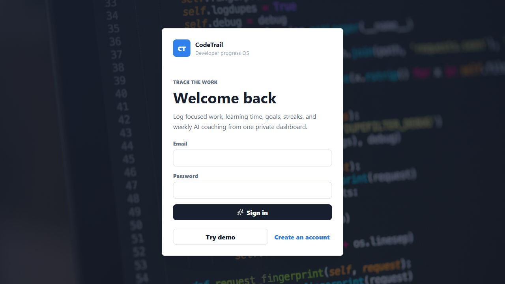
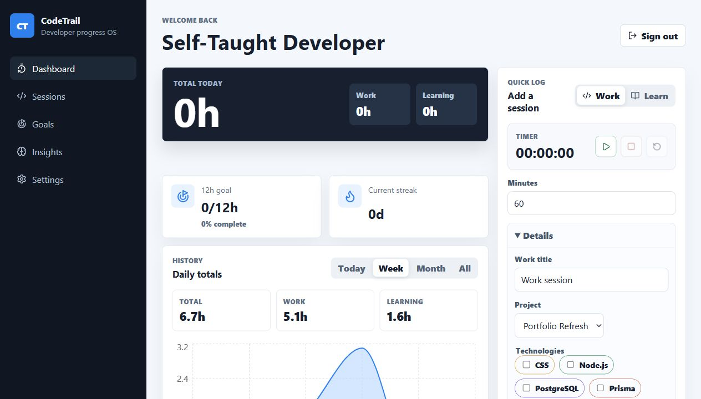
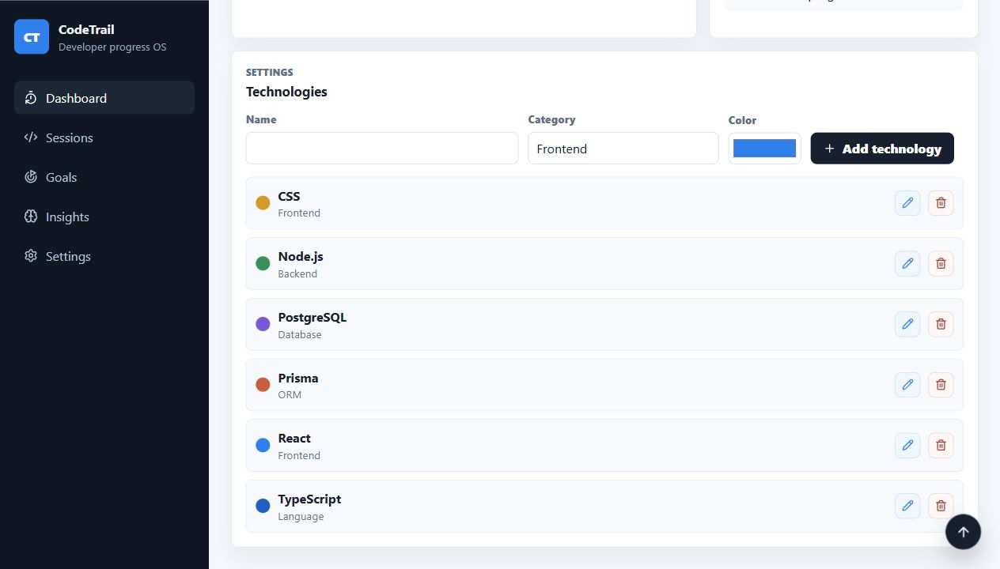

# CodeTrail

CodeTrail is a full-stack coding, learning, and work tracker for self-taught developers. It helps users log focused work sessions, track learning time, monitor weekly goals and streaks, manage their technology stack, and generate AI-assisted weekly summaries.

The app is built as a portfolio flagship project: a real product-shaped dashboard with authentication, user-owned data, PostgreSQL persistence, Prisma relationships, Render deployment, and a responsive React interface.

## Screenshots

### Login and Demo Access



### Dashboard



### Technology Settings



## Highlights

- Email/password authentication with HTTP-only session cookies
- Demo sign-in for quick portfolio review
- User-owned projects, technologies, sessions, goals, and summaries
- Quick session logging for Work and Learning
- Start/stop timer with local persistence
- Today, week, month, and all-time dashboard ranges
- Weekly hours goal and current streak at the top of the dashboard
- Daily totals chart and history view
- Technology focus chart powered by tagged sessions
- Settings page for adding, editing, and deleting technologies
- AI weekly summary endpoint using OpenAI when `OPENAI_API_KEY` is configured
- Render blueprint for API, static web app, and PostgreSQL database

## Tech Stack

- **Frontend:** React, Vite, TypeScript, Recharts, Lucide icons
- **Backend:** Node.js, Express, TypeScript, Zod
- **Database:** PostgreSQL, Prisma ORM
- **Auth:** salted password hashes, database-backed sessions, HTTP-only cookies
- **Deployment:** Render Blueprint
- **AI:** OpenAI Responses API integration for weekly summaries

## Product Flow

1. A user signs in, registers, or clicks **Try demo**.
2. The API creates a session, stores a hashed token, and sends the raw token in an HTTP-only cookie.
3. Protected API routes resolve the current user from the session cookie.
4. Dashboard data is scoped by `userId`, so each user only sees their own sessions, goals, projects, and technologies.
5. Users log Work or Learning sessions, optionally tag technologies, and the dashboard updates totals, charts, streaks, and goals.
6. The weekly AI summary uses current session and goal data to generate a concise coaching note.

## Repository Structure

```text
apps/
  api/
    prisma/          Database schema, migrations, and seed data
    src/             Express app, auth, routes, validators
  web/
    src/             React dashboard, API client, styles, mock data
render.yaml          Render deployment blueprint
package.json         Workspace scripts
```

## Local Setup

Install dependencies:

```bash
npm install
```

Copy API environment variables:

```bash
cp apps/api/.env.example apps/api/.env
```

Set `DATABASE_URL` in `apps/api/.env` to a PostgreSQL database.

Generate the Prisma client, apply migrations, and seed demo data:

```bash
npm run db:generate
npm run db:migrate
npm run db:seed
```

Run the app:

```bash
npm run dev
```

The frontend runs on `http://localhost:5173` and proxies API calls to `http://localhost:4000`.

## Useful Scripts

```bash
npm run dev          # start API and web workspaces
npm run build        # build API and web
npm run typecheck    # TypeScript checks
npm run lint         # frontend lint
npm run db:generate  # generate Prisma client
npm run db:migrate   # run local Prisma migration flow
npm run db:deploy    # apply migrations in deploy-style environments
npm run db:seed      # seed demo data
```

## Environment Variables

API:

```text
DATABASE_URL=postgresql://...
CORS_ORIGIN=http://localhost:5173
OPENAI_API_KEY=optional
NODE_ENV=development
PORT=4000
```

Web:

```text
VITE_API_URL=http://localhost:4000
```

For local development, `VITE_API_URL` can be omitted because Vite proxies `/api` to the API server.

## Deployment

`render.yaml` defines:

- `codetrail-api`: Node web service
- `codetrail-web`: static frontend
- `codetrail-db`: managed PostgreSQL database

Deploy with Render Blueprint:

1. Push the repo to GitHub.
2. In Render, choose **New > Blueprint**.
3. Connect the repo and let Render read `render.yaml`.
4. Create the services and database.
5. If Render gives either service a different public URL, update:
   - API service `CORS_ORIGIN`
   - Web service `VITE_API_URL`

The API start command runs Prisma migrations and seeds the demo dataset. Add `OPENAI_API_KEY` to the API service to enable live AI weekly summaries.

### Production Auth Note

The frontend and API are separate Render services, so production cookies use `SameSite=None; Secure`. Local development keeps `SameSite=Lax`.

## Portfolio Notes

CodeTrail demonstrates:

- Full-stack TypeScript architecture
- Relational modeling with Prisma joins
- Protected multi-user data access
- Session-based authentication
- Responsive dashboard design
- Optimistic UI updates for logging workflows
- Deployment configuration for a real hosted environment
- AI integration that uses the user's own progress data

## Future Improvements

- Password reset flow
- Rate limiting on auth routes
- More detailed AI coaching with trend analysis
- Project-specific goals
- Exportable reports or weekly email digests
