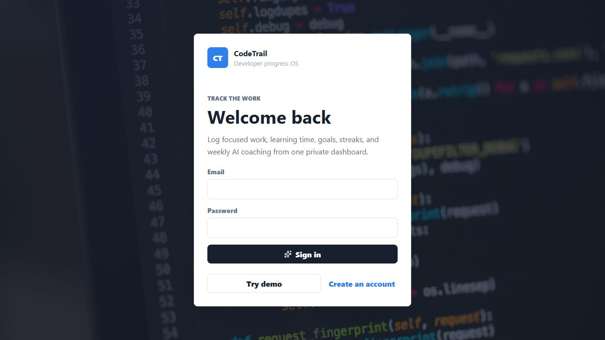
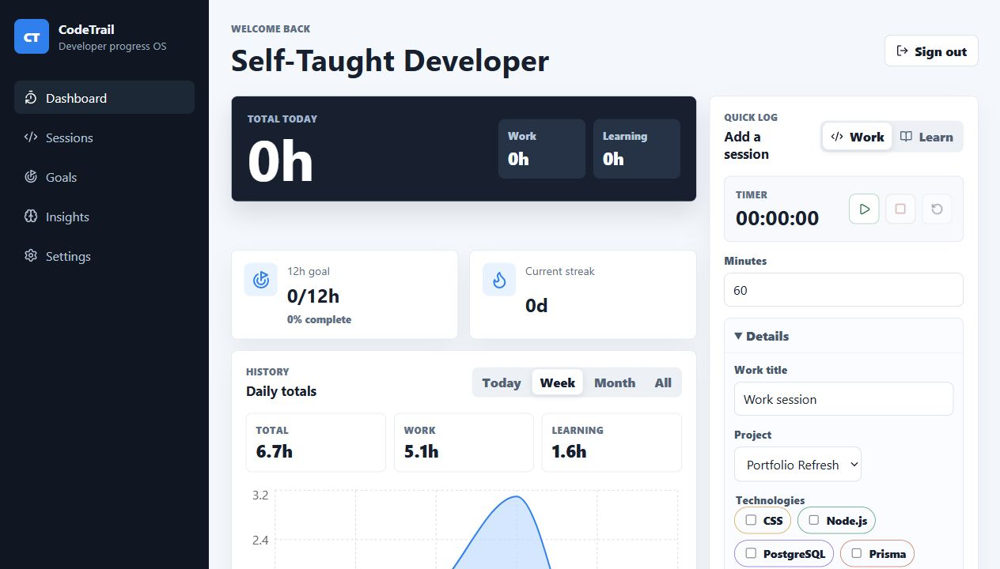
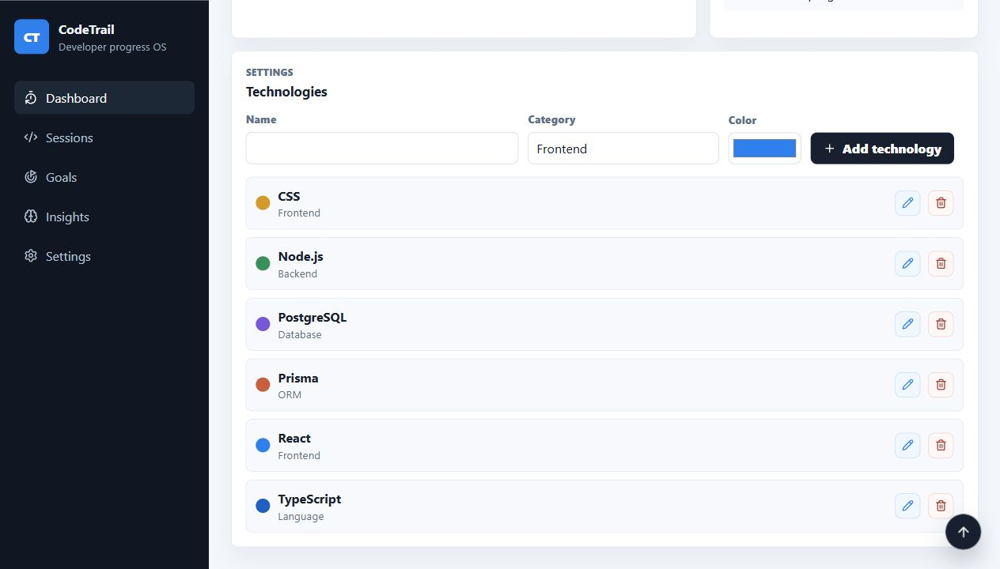

# CodeTrail

CodeTrail is a coding, learning, and work tracker for self-taught developers. It helps users log focused work sessions, track learning time, monitor weekly goals and streaks, manage their technology stack, and generate weekly summaries.

The repository includes two frontend apps: the original API-backed dashboard and a separate browser-only dashboard that uses localStorage. Both share the same product UI.

## Screenshots

### Login and Demo Access



### Dashboard



### Technology Settings



## Highlights

- Local demo, login, and registration screens backed by browser storage
- Persistent projects, technologies, sessions, goals, and summaries
- Quick session logging for Work and Learning
- Start/stop timer with local persistence
- Today, week, month, and all-time dashboard ranges
- Weekly hours goal and current streak at the top of the dashboard
- Daily totals chart and history view
- Technology focus chart powered by tagged sessions
- Settings page for adding, editing, and deleting technologies
- Deterministic weekly summaries generated from local progress data
- Optional full-stack API, static web app, and PostgreSQL deployment files

## Tech Stack

- **Frontend:** React, Vite, TypeScript, Recharts, Lucide icons
- **Backend:** Node.js, Express, TypeScript, Zod
- **Database:** PostgreSQL, Prisma ORM
- **Auth:** salted password hashes, database-backed sessions, HTTP-only cookies
- **Deployment:** Render Blueprint
- **AI:** OpenAI Responses API integration for weekly summaries

## Product Flow

1. The browser initializes a local CodeTrail store with demo data.
2. Users log Work or Learning sessions, optionally tag technologies, and the dashboard updates totals, charts, streaks, and goals.
3. Projects, technologies, sessions, goals, and user details are written to localStorage.
4. The weekly summary is generated from the current local progress data.

## Repository Structure

```text
apps/
  api/
    prisma/          Database schema, migrations, and seed data
    src/             Express app, auth, routes, validators
  web/
    src/             React dashboard, API client, styles, mock data
render.yaml          Render deployment blueprint
package.json         Workspace scripts
```

## Local Setup

Install dependencies:

```bash
npm install
```

For the localStorage version, no API or database setup is required. Install dependencies and run the separate local app:

```bash
npm install
npm run dev:local
```

The local app runs on `http://localhost:5174`. To reset local data, remove the `codetrail.local.v1` entry from that browser origin's localStorage.

The original full-stack app remains available with:

```bash
npm run dev
```

The API-backed frontend runs on `http://localhost:5173` and requires PostgreSQL and the API environment variables described below.

## Useful Scripts

```bash
npm run dev          # start API and web workspaces
npm run build        # build API and web
npm run typecheck    # TypeScript checks
npm run lint         # frontend lint
npm run db:generate  # generate Prisma client
npm run db:migrate   # run local Prisma migration flow
npm run db:deploy    # apply migrations in deploy-style environments
npm run db:seed      # seed demo data
```

## AI Summary Behavior

Weekly summaries use the OpenAI API when `OPENAI_API_KEY` is configured and the account has available API quota. If no key is configured, or the API returns a quota/error response, CodeTrail falls back to a deterministic coaching summary built from the same progress data: total hours, work and learning split, streak, goal progress, top technologies, and recent sessions.

This keeps the live demo usable without requiring paid API credits.

## Environment Variables

API:

```text
DATABASE_URL=postgresql://...
CORS_ORIGIN=http://localhost:5173
OPENAI_API_KEY=optional
NODE_ENV=development
PORT=4000
```

Web:

```text
VITE_API_URL=http://localhost:4000
```

For local development, `VITE_API_URL` can be omitted because Vite proxies `/api` to the API server.

## Deployment

`render.yaml` defines:

- `codetrail-api`: Node web service
- `codetrail-web`: static frontend
- `codetrail-db`: managed PostgreSQL database

Deploy with Render Blueprint:

1. Push the repo to GitHub.
2. In Render, choose **New > Blueprint**.
3. Connect the repo and let Render read `render.yaml`.
4. Create the services and database.
5. If Render gives either service a different public URL, update:
   - API service `CORS_ORIGIN`
   - Web service `VITE_API_URL`

The API start command runs Prisma migrations and seeds the demo dataset. Add `OPENAI_API_KEY` to the API service to enable OpenAI-generated weekly summaries. Without API quota, the app uses the built-in fallback summary.

### Production Auth Note

The frontend and API are separate Render services, so production cookies use `SameSite=None; Secure`. Local development keeps `SameSite=Lax`.

## Portfolio Notes

CodeTrail demonstrates:

- Full-stack TypeScript architecture
- Relational modeling with Prisma joins
- Protected multi-user data access
- Session-based authentication
- Responsive dashboard design
- Optimistic UI updates for logging workflows
- Deployment configuration for a real hosted environment
- AI integration that uses the user's own progress data

## Future Improvements

- Password reset flow
- Rate limiting on auth routes
- More detailed AI coaching with trend analysis
- Project-specific goals
- Exportable reports or weekly email digests
